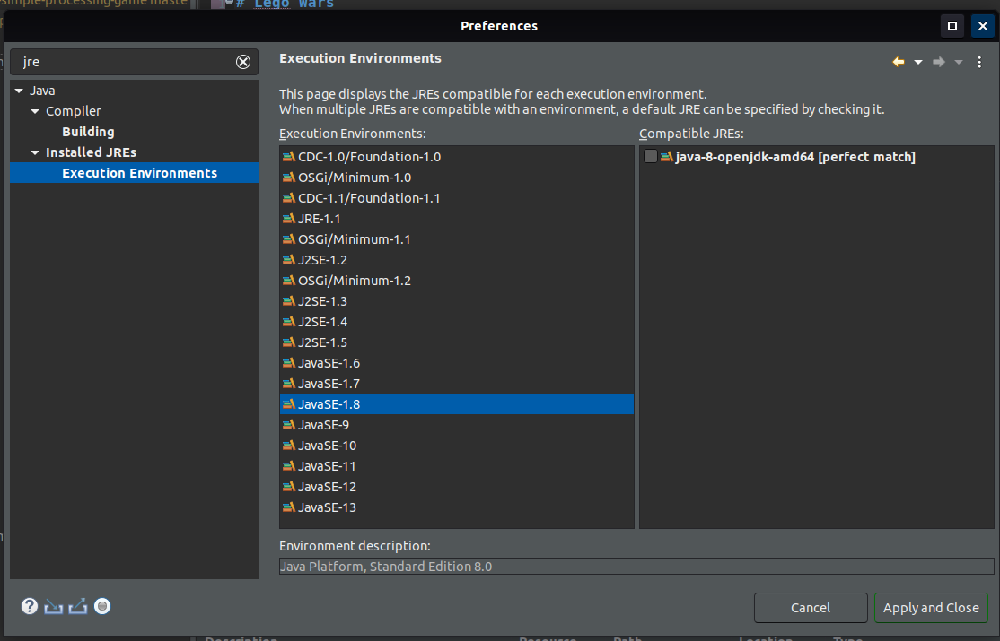

# ⚔️ 🎮 Lego Wars
A Processing game built in Java

## 📺 Steps for running the game in eclipse
1. Change the Execution environment to JavaSE-1.8 (Java-8-openjdk)
	```text
	# From the menu bar on the top
	Window > Preferences
	# Search for execution Environments 
	Java > Installed JREs > Execution Environments
	# Select JavaSE-1.8 > Apply and close
	```
	
2. Add the jar file: ```core.jar``` located in the src folder to the build path
	```text
	right click on the core.jar file > Build Path > Add to Build Path
	```
3. Run the main program ```LegoWars.java```

📜 ## Game Instructions
The game has three levels:
You advance to level 2 after 500 points and to level 3 after 1500 points
You can only attack (shoot)🤾🏿 and defeat the enemy in Level 3.
Enjoy!

**KEYS:**
⬆️ UP for jumping 
➡️ RIGHT for shooting

### Gameplay😎


### References
* [Adding the core.jar to Build path in IntelliJ IDEA](https://stackoverflow.com/questions/1051640/correct-way-to-add-external-jars-lib-jar-to-an-intellij-idea-project)
* Read more on [Processing](https://knowledge.kitchen/Introduction_to_Processing)

This was one of my first Java programs.🙌
